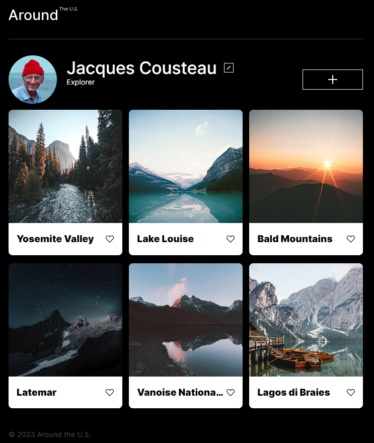
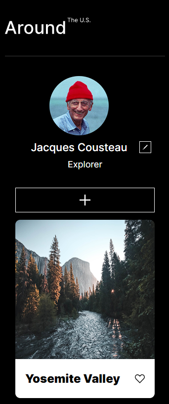

# Project 3: Around The U.S.

In this project we work with a Figma design that provides layouts for mobile (320px) and desktop (1280px). Building on the last project where we laid out the sturcture and design on the webpage, we've features to the project by making it functional.

### Overview

- Intro
- Figma
- Images

**Intro**

The user can write a custom name for the card and add a link to a picture. If the user clicks on the "Like" button, the heart changes its color, add a delete icon to the cards. Once a user clicks on a picture, the modal box with that picture opens. When they click "Close," it closes. All the modal boxes smoothly appear out from transparency, and when being closed, they smoothly become completely transparent again.

## Project features

The functionalities we used:

- Rendering cards
- Form for adding a card
- Adding a card
- The "Like" button
- Deleting a card
- Opening the picture modal
- Smooth modal opening and closing

**GitHub Pages**

https://thockyantho.github.io/se_project_aroundtheus/

**Figma**

- https://www.figma.com/file/JFPhASqvZ5pBjQV2ouUlim/Sprint-5_-Around-The-U.S.-_-desktop-%2B-mobile-(Copy)?type=design&node-id=0-1&mode=design&t=L68VSkAN7MSMNRKJ-0

**Reference Images**

Web:

Mobile:

